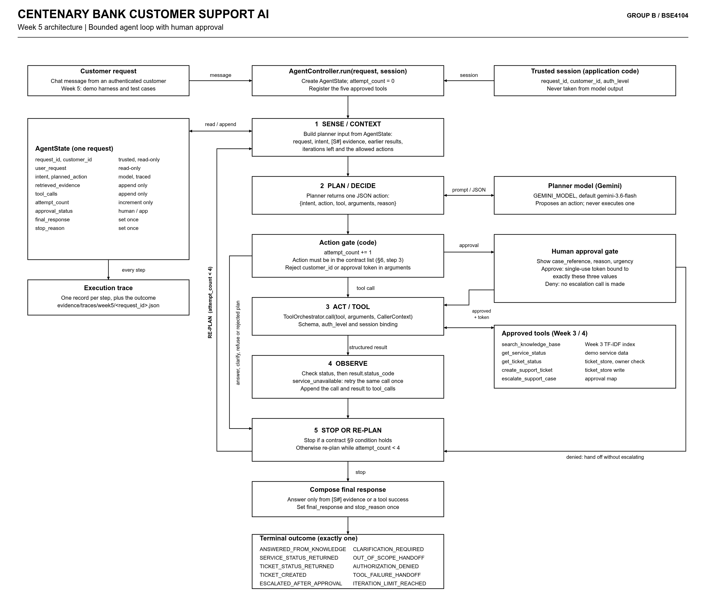

# Week 5 Agent Architecture

**Project:** Centenary Bank Helpdesk Agent  
**Course:** BSE4104, Group B  
**Week:** 5 - Agent Architecture and Bounded Autonomy  
**Related:** [Week5_Agent_Task_Contract.md](../requirements/Week5_Agent_Task_Contract.md)  
**Code baseline:** `6b219d7`




## 1. What changes this week

Weeks 3 and 4 gave us the parts: a RAG pipeline and a `ToolOrchestrator` that validates and runs one tool call at a time. Until now, a human (`demo.py` or a test) decided which tool to call next.

In Week 5 we add an `AgentController` that makes that decision in a bounded loop. The model proposes the next step, and code checks, runs, counts and stops it. We do not change `ToolOrchestrator` or the tool functions. The new pieces wrap around them.

| Component | Status | Responsibility |
|---|---|---|
| `AgentController` | New | Runs the loop, owns `AgentState`, enforces limits, picks the terminal outcome |
| Planner adapter | New | Sends planner input to Gemini and parses one JSON action |
| Action gate | New | Checks the proposed action before anything runs |
| Human approval gate | New (simulated) | Shows the escalation details and issues a single-use token on approval |
| Trace recorder | New | Writes one record per step to `evidence/traces/week5/` |
| `ToolOrchestrator.call` | Reused (Week 4) | Schema, session binding, `auth_level`, approval and output checks |
| Five tools | Reused (Weeks 3-4) | `search_knowledge_base` wraps the Week 3 RAG pipeline; the other four are the Week 4 tools |

Note: `demo.py` currently registers four tools. The controller must also register `make_search_knowledge_base_tool(...)` so that all five contract tools are available.

## 2. One pass through the loop

An **iteration** is one planner decision. The controller allows at most four.

1. **Sense / context.** The controller builds the planner input from `AgentState`: the original request, the current intent, the evidence retrieved so far (with `[S#]` markers), earlier tool results, the number of iterations left, and the list of allowed actions.
2. **Plan / decide.** Gemini returns exactly one action as JSON: `{intent, action, tool, arguments, reason}`. If the JSON cannot be parsed, the controller treats it as a rejected plan.
3. **Action gate.** The controller increments `attempt_count`, then checks that the action is one of the seven actions in contract §6 step 3 and that the tool is on the allow-list. If the arguments contain `customer_id` or `human_approval_token`, the plan is rejected.
   - *Answer, clarify or refuse* need no tool, so they go straight to step 5.
   - *Request escalation approval* goes to the human approval gate.
   - *Tool call* goes to step 3.
4. **Act / tool.** The controller calls `ToolOrchestrator.call(tool, arguments, CallerContext)`, with `CallerContext` built from the trusted session and never from model output.
5. **Observe.** The controller reads `status` first, then `result.status_code`. It appends the call and its result to `tool_calls`, and any search passages to `retrieved_evidence`.
6. **Stop or re-plan.** If a contract §9 condition holds, the controller stops and composes the final response. Otherwise it goes back to step 1, as long as `attempt_count < 4`.

## 3. Who controls what

| The model may | Only code may |
|---|---|
| Classify intent | Set `customer_id`, `auth_level` or `request_id` |
| Choose one allowed action | Issue or attach an approval token |
| Fill tool arguments other than identity and token | Execute a tool |
| Word the final response from evidence or tool results | Increment `attempt_count` or decide to stop |
| | Choose the terminal outcome |

## 4. Mapping results to the next step

This table is the core of the Observe step. **`status: "success"` does not always mean the request succeeded.** `get_ticket_status` returns `success` with `result.status_code = "UNAUTHORIZED"` when the ticket belongs to another customer.

| Result | Next step | Terminal outcome |
|---|---|---|
| `search_knowledge_base` success with results | Store evidence, re-plan (normally to answer) | `ANSWERED_FROM_KNOWLEDGE` once the answer is given |
| `get_service_status` success, `OK` | Stop | `SERVICE_STATUS_RETURNED` |
| `get_ticket_status` success, `OK` | Stop | `TICKET_STATUS_RETURNED` |
| `get_ticket_status` success, `NOT_FOUND` | Ask the customer to confirm the ticket ID | `CLARIFICATION_REQUIRED` |
| `get_ticket_status` success, `UNAUTHORIZED` | Stop; reveal nothing about the ticket | `AUTHORIZATION_DENIED` |
| `create_support_ticket` success, `OK` | Stop | `TICKET_CREATED` |
| `escalate_support_case` success, `OK` | Stop | `ESCALATED_AFTER_APPROVAL` |
| `escalate_support_case` success, `UNAUTHORIZED` (token mismatch) | Stop | `AUTHORIZATION_DENIED` |
| error `unauthorized` | Stop | `AUTHORIZATION_DENIED` |
| error `invalid_arguments` | Re-plan; do not repeat the same call | none yet |
| error `service_unavailable` | Retry the same call once, inside the same iteration | `TOOL_FAILURE_HANDOFF` if the retry also fails |
| error `unexpected_response` | Stop; do not retry, do not claim success | `TOOL_FAILURE_HANDOFF` |
| Rejected plan (bad JSON, unknown action or tool, identity in arguments) | Re-plan | none yet |
| Out-of-scope or unsafe request | Refuse and offer human help | `OUT_OF_SCOPE_HANDOFF` |
| `attempt_count` reaches 4 with no terminal result | Stop | `ITERATION_LIMIT_REACHED` |

**Why we never retry `unexpected_response`:** `create_support_ticket` writes to `ticket_store` *before* the malformed response is returned. A retry would create a duplicate ticket. A `service_unavailable` retry is safe because every current tool raises that error before writing anything.

## 5. Escalation and approval

In the orchestrator, the approval token is bound *before* the `human_approved` check. So if you call `escalate_support_case` without a token, you get `unauthorized`, not `pending_approval`. For that reason, approval is a step of its own and happens before the tool is called:

1. The planner chooses *request escalation approval* and proposes `case_reference`, `reason` and `urgency`.
2. The approval gate shows those three values to a human reviewer and sets `approval_status = pending`.
3. **On approval:** the gate issues a single-use token bound to exactly those values. The controller builds a new `CallerContext(human_approved=True, human_approval_token=...)` and calls `escalate_support_case`. The tool consumes the token, so it cannot be reused.
4. **On denial:** no escalation call is made, and the customer is told a human will need to follow up through another channel.

## 6. Trace record

The controller appends one record per iteration to `evidence/traces/week5/<request_id>.json`, and one final record at stop:

```
iteration, intent, planned_action, gate_decision,
tool_name, arguments (identity and token redacted),
status, status_code / error_type, retried (true/false),
approval_status, stop_reason, terminal_outcome
```

The traces required this week (a grounded answer, a ticket workflow, and a failure/recovery case) should come from this file, not from console output.

## 7. Open points for the implementation

- **Escalation denied.** The contract does not name an outcome for this case. We suggest `OUT_OF_SCOPE_HANDOFF`, but the group should confirm.
- **Search returns no usable evidence.** The contract says to state the gap and offer a hand-off, but it does not name the outcome. The same question applies here.
- **Retry inside the iteration.** We treat a safe retry as part of the same iteration, so a flaky service does not use up the four-iteration budget. If the group prefers to count retries as iterations, update the diagram note.
