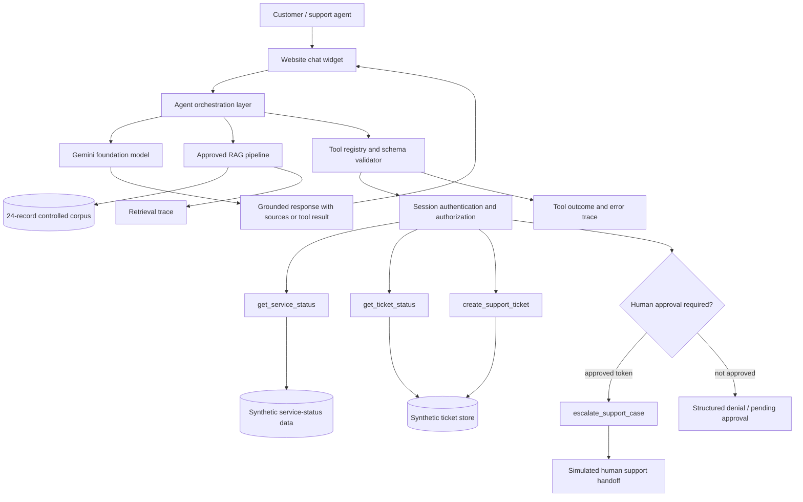

# Updated Agent Architecture - Week 4

This architecture extends the Week 3 grounded RAG flow with an allow-listed tool registry, deterministic validation, authorization, structured failures and a human approval gate for higher-impact actions.

## Week 4 boundary

The model may request one of the four registered tools, but it cannot execute arbitrary functions or supply trusted identity and approval values. The orchestration layer injects session-bound `customer_id`, validates arguments and output, checks authorization, and converts failures into structured results. All service, ticket and escalation records are synthetic in-memory fixtures; no live banking system is accessed.

