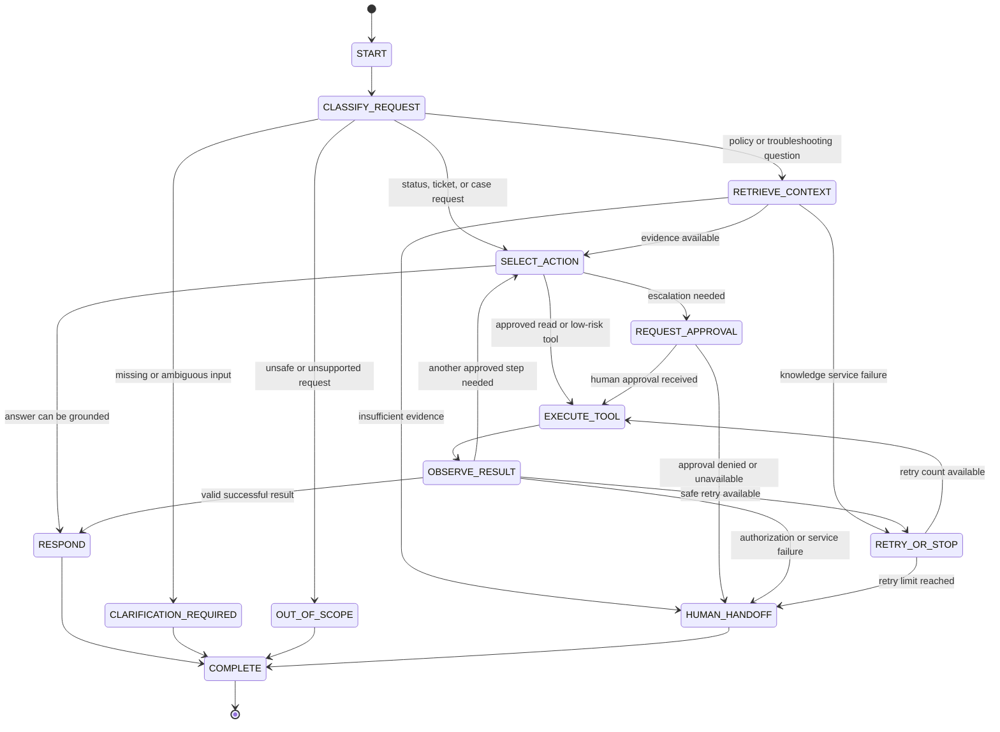

# Week 6 State Model

**Project:** Centenary Bank Helpdesk Agent  
**Course:** BSE4104 Emerging Trends in Software Engineering  
**Week:** 6 - Memory, State and Interoperability  
**Deliverable:** State Model

## 1. Purpose

This state model makes the helpdesk agent's workflow state explicit. It separates customer/session data, temporary reasoning state, tool results, approval state, and the final outcome. The agent can propose the next action, but trusted application code remains responsible for identity, authorization, approval tokens, and tool execution.

## 2. Workflow state diagram

## 3. State fields

| Field | Description | Source | Access/control rule |
|---|---|---|---|
| `request_id` | Unique identifier for the interaction | Trusted application | Immutable during the workflow |
| `customer_id` | Authenticated customer identity | Trusted session | Never accepted from model-generated tool arguments |
| `user_request` | Original customer message | User/application | Kept for traceability |
| `intent` | Classified support intent | Agent | Updated with a trace entry |
| `retrieved_evidence` | Source passages returned by the approved knowledge base | RAG tool | Append-only; used to ground answers |
| `planned_action` | Next action selected by the agent | Agent | Must be in the approved action allow-list |
| `tool_calls` | Tool name, validated arguments, result, and status | Orchestrator | Append-only audit trail |
| `attempt_count` | Number of workflow iterations | Orchestrator | Increment-only; maximum four |
| `retry_count` | Number of retries for the current failure | Orchestrator | Maximum one safe retry per failed call |
| `approval_status` | Not required, pending, approved, or denied | Trusted application/human | Controlled outside the model |
| `memory_context` | Relevant approved historical case information | Memory store | Read only for the current decision unless a write is authorized |
| `final_response` | Answer, confirmation, clarification, refusal, or handoff | Agent | Set only when stopping |
| `stop_reason` | Recorded terminal outcome | Orchestrator/agent | Set once at completion |

## 4. State transition rules

1. Every request begins in `START` and receives a `request_id`.
2. `customer_id` is loaded from the authenticated session, not from the user message or model output.
3. The agent classifies the request before selecting a tool.
4. Knowledge questions must use retrieved evidence before the agent gives a procedural answer.
5. Only approved tools may be selected.
6. Tool arguments and outputs are validated by the orchestrator.
7. A failed tool call may be retried once only when the retry is safe and does not duplicate a side effect.
8. Escalation cannot move from `REQUEST_APPROVAL` to `EXECUTE_TOOL` without human approval for the exact case, reason, and urgency.
9. The workflow stops at a valid terminal outcome or when the four-iteration limit is reached.
10. A final response must match the recorded `stop_reason` and must never claim an unconfirmed action succeeded.

## 5. Terminal outcomes

The workflow ends with exactly one of the following outcomes:

- `ANSWERED_FROM_KNOWLEDGE`
- `SERVICE_STATUS_RETURNED`
- `TICKET_STATUS_RETURNED`
- `TICKET_CREATED`
- `ESCALATED_AFTER_APPROVAL`
- `CLARIFICATION_REQUIRED`
- `OUT_OF_SCOPE_HANDOFF`
- `AUTHORIZATION_DENIED`
- `TOOL_FAILURE_HANDOFF`
- `ITERATION_LIMIT_REACHED`

## 6. Relationship to memory

Persistent memory is not the same as temporary workflow state. Workflow state exists for the current interaction and trace. Approved case-history memory may survive the session, but it is loaded only when relevant to the authenticated customer's current support request. Memory may help the agent continue a case, but it must not silently authorize actions or make financial, account, legal, or other high-impact decisions.

## 7. Acceptance checks

The state model is complete when:

- All major workflow stages and transitions are represented.
- Success, clarification, failure, retry, authorization, and human-handoff paths are included.
- State fields have clear sources and access controls.
- Iteration and retry limits are explicit.
- Terminal outcomes are defined and traceable.
- The model distinguishes temporary workflow state from persistent memory.

