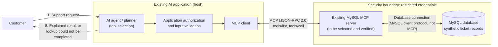

# Week 6: MCP-Style Interface Specification for the Centenary Bank Customer Support AI Agent

| Field | Value |
|---|---|
| Course / assignment | BSE4104 AI Agentic Capstone, Week 6: Memory, State and Interoperability |
| Project | Centenary Bank Customer Support AI Agent |
| Author / team | `[Author name — placeholder]` / `[Team name — placeholder]` |
| Document status | Design specification. **No part of this design has been implemented or executed.** |
| Date | `[Submission date — placeholder]` |

**Status labels used in this document**

| Label | Meaning |
|---|---|
| **Current** | Confirmed project context |
| **Proposed** | Part of the intended design |
| **Assumption** | A condition that needs confirmation |
| **Future work** | Implementation not yet completed |
| **Not executed** | A test that has only been designed |

---

## 1. Executive Summary

This document specifies how the Centenary Bank Customer Support AI Agent could, in a future implementation, retrieve support-ticket information through the Model Context Protocol (MCP). The proposal uses an **existing** MySQL MCP server rather than a custom-built one. The agent would use an MCP client to call a narrow, read-only tool, `get_ticket_status`, which returns the status and a few limited details of a single ticket from a local MySQL database containing **synthetic** records.

**Current:** No ticket database exists, no MCP server is integrated, and no MCP call has been made. This document therefore describes an interface and a verification plan, not a working integration. Optional extensions (`update_ticket_status`, `create_support_ticket`) are described as possibilities, and ticket deletion is excluded from the initial scope.

The main design principles are: use a narrow task-specific interface, apply least-privilege database access, enforce authorization in the application rather than trusting prompts, and never let the agent invent a result when a dependency fails.

---

## 2. Project Context and Current Implementation Status

The agent handles customer-support requests using AI-based reasoning and tool use. Earlier project scenarios involved retrieving ticket status and handling service-related requests. Week 6 requires explicit workflow/session state, one justified persistent-memory use case, memory documentation, a demonstration, and either an external integration or an MCP-style interface specification. This document is the interoperability deliverable.

| Item | Status | Notes |
|---|---|---|
| AI agent with reasoning and tool use | **Current** | Existing project capability |
| Persistent MySQL ticket database | **Not present** | Must be provisioned (Future work) |
| MySQL MCP server | **Not integrated** | Selection and verification pending (Future work) |
| MCP client in the agent | **Not present** | Future work |
| Database tables, APIs, credentials, authentication, deployment infrastructure | **Assumption: not established** | No supporting project evidence supplied |
| Real Centenary Bank data | **Not used** | Out of scope; synthetic data only |

---

## 3. Objectives and Scope

### 3.1 Objectives

1. Define a ticket-status lookup capability that the agent can use through MCP.
2. Specify inputs, outputs, validation, and errors precisely enough to guide implementation.
3. Define permission, security, and privacy boundaries suitable for customer-support data.
4. Define a test plan against which a future implementation can be judged.

### 3.2 In scope

- Ticket status lookup (`get_ticket_status`, primary capability).
- A controlled status update (`update_ticket_status`, optional extension).
- Ticket creation (`create_support_ticket`, optional extension).
- Documented exclusion of ticket deletion.
- Authorization, least privilege, data protection, failure handling, tests, dependencies, and risks.

### 3.3 Out of scope

Building an MCP server; installing or configuring MySQL; connecting the agent to a database; executing MCP calls or integration tests; a production banking design; real customer data; replacing the agent architecture; a full ticket-management backend; and implementing persistent conversational memory inside the MCP server.

---

## 4. Proposed Architecture

**Proposed.** MCP is a client–server protocol. In MCP terminology, a *host* is the LLM application, a *client* inside the host keeps a one-to-one connection with a *server*, and the server provides tools and other context to the client [1]. MCP messages use JSON-RPC 2.0 over a transport such as stdio or Streamable HTTP [1][3]. MCP is the protocol for exposing and invoking capabilities. It is **not** a database, **not** a memory mechanism, and **not** an authorization system by itself; those concerns are handled by other components described below.



The arrows between the client and the server carry MCP. The link between the MCP server and MySQL is an ordinary database connection configured on the server. The response travels back along the same path: database → MCP server → MCP client → agent → customer.

**Security boundaries.** There are two. The first lies between the agent application and the MCP server: the application must decide whether a given requester may call a tool for a given ticket *before* the call is made. The second lies between the MCP server and MySQL: the server connects with a dedicated, minimally privileged database account, so that even a misbehaving tool call cannot exceed what the database allows.

**Deployment (local demonstration, Assumption).** The agent and MCP client run in the existing application on one development computer. The MCP server and MySQL also run locally, and the server connects to MySQL via a configured host and port. `127.0.0.1` refers to the loopback interface of the environment in which the connection is made. If the MCP server runs inside a container, `localhost` or `127.0.0.1` refers to that container, not the host computer, so the database host setting must be chosen accordingly. No cloud database or public internet exposure is required. If HTTP-based transport is used, the MCP specification requires servers to validate the `Origin` header and respond with HTTP 403 when it is present and invalid [3]; local-only binding is advisable.

---

## 5. Component Responsibilities

| Component | Responsibilities | Not responsible for |
|---|---|---|
| **AI agent** | Understands the request; decides whether a tool is appropriate; invokes tools through the MCP client; interprets results; explains the outcome to the customer; reports failure honestly | Enforcing database permissions; holding credentials |
| **MCP client** | Connects to the MCP server; discovers tool definitions (`tools/list`); sends tool calls (`tools/call`); receives results and errors; exposes tools to the agent workflow [2] | Deciding who may see a ticket |
| **Existing MySQL MCP server** | Exposes selected database capabilities as tools; validates or constrains operations to the extent its implementation supports; connects to MySQL with configured credentials; returns results or errors | Business-level authorization (**Assumption:** it does not enforce this) |
| **MySQL database** | Stores ticket records; enforces database-level privileges; is the source of truth for ticket data | Understanding user intent |

**Future work:** the database does not exist yet and must be provisioned, with a ticket schema and synthetic records, if the team proceeds.

**Server selection (Assumption).** The specific MySQL MCP server has not been selected. This design is implementation-neutral and does not assume any tool name, command-line option, or configuration key of a particular server. Before selection, the team must verify from the server's official documentation and repository: (a) which tools it actually exposes; (b) which transports it supports and whether they match the MCP client; (c) whether it supports writes at all; (d) whether it offers a read-only mode or permission controls; and (e) how it handles credentials and logging. A server that exposes only generic SQL execution cannot directly implement the narrow tools below; in that case the application layer must constrain what is sent (see Section 9.3).

---

## 6. MCP Capability Specification

The capability is **ticket management**, exposed through task-specific tools. The tool names below are the *logical interface of this project*. They are **Proposed** names; a real MySQL MCP server may expose differently named tools, in which case the MCP client or agent layer must map them (Section 14).

### 6.1 Tool summary

| Tool | Purpose | Side effects | Initial scope |
|---|---|---|---|
| `get_ticket_status` | Retrieve status and limited details of one ticket | None (read-only) | **Included (primary)** |
| `update_ticket_status` | Change a ticket's status under defined rules | Modifies one record | Optional extension |
| `create_support_ticket` | Create a new ticket | Inserts one record | Optional extension |
| Ticket deletion | Remove a ticket | Destructive | **Excluded** |

### 6.2 Primary tool: `get_ticket_status`

| Attribute | Specification |
|---|---|
| Name | `get_ticket_status` |
| Description | Returns the current status and a limited set of details for one support ticket identified by its ticket ID |
| Required input | `ticket_id` (string) |
| Optional input | None |
| Side effects | **None.** The operation must not modify any record |
| Permission | Application may invoke the tool; the requester must be authorized for the specific ticket (Section 9.2) |
| Data restriction | Returns only the four fields below; never returns unrestricted rows, other customers' data, or internal columns |

**Input validation (applied by the application before the call, and again by the server or database layer where supported):**

| Field | Type | Required | Rule |
|---|---|---|---|
| `ticket_id` | string | Yes | Non-empty; trimmed; matches the pattern `^CS-[0-9]{5,8}$` (**Assumption:** this ID format is illustrative and must be confirmed against the real schema); maximum 16 characters; must be passed as a bound parameter, never concatenated into SQL |

**Example input (conceptual):**

```json
{
  "ticket_id": "CS-10245"
}
```

**Output schema:**

| Field | Type | Required | Notes |
|---|---|---|---|
| `ticket_id` | string | Yes | Echoes the requested ID |
| `status` | string (enum) | Yes | One of the allowed status values (Section 6.3) |
| `category` | string | Yes | Short category label |
| `summary` | string | Yes | Short, non-sensitive description; length-limited |

**Example successful output (illustrative synthetic data, not a verified live ticket and not output from any real MCP server):**

```json
{
  "ticket_id": "CS-10245",
  "status": "in_progress",
  "category": "mobile_banking",
  "summary": "Repeated mobile app login failures"
}
```

### 6.3 Proposed status vocabulary

**Assumption:** the project has no agreed status policy. The following values are a **Proposed** set requiring team agreement:

`open`, `in_progress`, `awaiting_customer`, `resolved`, `closed`.

The agent must only report values from the agreed set and must never invent a status.

### 6.4 Optional extension: `update_ticket_status` (Proposed, only if it can be implemented safely)

| Attribute | Specification |
|---|---|
| Inputs | `ticket_id` (string, same validation as above); `new_status` (string, must be one of the allowed values) |
| Optional input | `expected_current_status` (string), used for conflict detection |
| Authorization | A separate, stronger permission than lookup; restricted to authorized support staff roles (**Assumption:** role model not yet defined). Customers' agent sessions should not hold this permission |
| Validation | The ticket must exist; the current status is read and compared with `expected_current_status`; the transition must be permitted |
| Output | `ticket_id`, `previous_status`, `new_status`, `updated` (boolean) |
| Errors | `TICKET_NOT_FOUND`, `INVALID_STATUS`, `INVALID_TRANSITION`, `ACCESS_DENIED`, `CONFLICT` |

**Proposed transitions (require team agreement; no existing policy is assumed):**

| From | Allowed to |
|---|---|
| `open` | `in_progress`, `closed` |
| `in_progress` | `awaiting_customer`, `resolved` |
| `awaiting_customer` | `in_progress`, `closed` |
| `resolved` | `closed`, `in_progress` (reopen) |
| `closed` | None |

The actual update should be conditional or transactional, for example by updating only when the stored status still equals the expected value and checking the affected-row count, so that two concurrent changes cannot silently overwrite each other. The LLM must not choose arbitrary values or bypass these rules; the application validates `new_status` against the enumerated set and transition table before any call is made. Consequential changes should require human confirmation or approval.

### 6.5 Optional extension: `create_support_ticket` (Proposed)

| Field | Type | Required | Validation |
|---|---|---|---|
| `category` | string (enum) | Yes | One of an agreed category list |
| `summary` | string | Yes | 1–200 characters; control characters removed |
| `customer_reference` | string | Yes | **Unresolved dependency.** The project has not established a customer identity model; this field must not be implemented until that model exists |
| `idempotency_key` | string | Recommended | Prevents repeated requests from creating duplicate tickets |

The ticket ID and the initial status (`open`) should be assigned by the system, not by the LLM.

### 6.6 Excluded: ticket deletion

Deletion is **not** part of the initial tool set. It is irreversible, may conflict with record-retention and audit obligations, and an error or prompt manipulation could destroy evidence of a customer's complaint. It should remain unavailable unless there is an approved business requirement, appropriate authorization, and a defined retention policy. If a closure-like need arises, the `closed` status already provides a non-destructive alternative.

---

## 7. Inputs, Outputs, and Error Handling

MCP distinguishes protocol-level errors (standard JSON-RPC errors, for example an unknown tool) from errors that occur while a tool executes [2]. The exact representation of tool errors depends on the chosen MCP server and SDK. The application should therefore **normalize** all failures into one predictable structure before the agent sees them.

**Proposed normalized error format:**

```json
{
  "error": {
    "code": "TICKET_NOT_FOUND",
    "message": "No ticket was found for the given ID.",
    "retryable": false
  }
}
```

| Condition | Code | Retryable | Agent behaviour |
|---|---|---|---|
| Ticket ID missing | `MISSING_TICKET_ID` | No | Ask the customer for the ticket ID |
| Invalid ID format | `INVALID_TICKET_ID` | No | Explain the expected format; ask again; make no call |
| Ticket not found | `TICKET_NOT_FOUND` | No | Say no matching ticket was found; suggest checking the ID |
| Access denied | `ACCESS_DENIED` | No | State that the ticket cannot be shown; do not reveal whether it exists |
| Database unavailable | `DATABASE_UNAVAILABLE` | Yes | Say the lookup could not be completed; do not guess a status |
| MCP server unavailable | `MCP_SERVER_UNAVAILABLE` | Yes | Same as above |
| Query timeout | `QUERY_TIMEOUT` | Yes (limited) | Same as above; retry at most once |
| Unexpected internal error | `INTERNAL_ERROR` | No | Generic failure message; log details internally |

**Rules.** Errors returned to the customer-facing agent must **not** contain SQL statements, credentials, connection strings, stack traces, or other database internals; these belong only in protected internal logs. Each call should have a defined timeout (for example a few seconds; **Assumption:** value to be tuned), and retries must be bounded.

---

## 8. Example Workflow (Proposed)

All steps below are **Proposed**; none has been executed.

### 8.1 Success scenario

Customer message: *"What is happening with my ticket CS-10245?"*

1. The agent receives the request.
2. The agent determines that current ticket information is required.
3. The agent selects `get_ticket_status` with `{"ticket_id": "CS-10245"}`; the application validates the format and checks that the requester is authorized for this ticket.
4. The MCP client invokes the tool using a `tools/call` request over MCP.
5. The MCP server queries the configured MySQL database through its database connection.
6. The tool returns the matching record (four fields only), subject to authorization.
7. The agent interprets the result.
8. The agent replies, for example: "Your ticket CS-10245 about repeated mobile app login failures is currently in progress."
9. The application records only the workflow outcome (for example: tool used, ticket ID, outcome `success`, timestamp), not unnecessary ticket content.

### 8.2 Failure scenario: database unavailable

Steps 1–4 are identical. At step 5 the server cannot reach MySQL and returns an error, which the application normalizes to `DATABASE_UNAVAILABLE`. The agent replies, for example: "I couldn't retrieve the status of ticket CS-10245 right now. Please try again shortly or contact a support officer." The agent must not state or imply a status, and workflow state records the outcome as `failed`, not as a stale status.

---

## 9. Permissions, Security, and Privacy

### 9.1 Least privilege

- Use a **dedicated** database account for the MCP server, never an administrative account.
- For the initial lookup demonstration, grant read-only privileges (for example `SELECT`) on the ticket table or a restricted view only. MySQL privileges are assigned to accounts with the `GRANT` statement, and removed with `REVOKE` [4].
- If updates are enabled later, grant only `UPDATE` on the necessary columns (status and last-updated), where MySQL column-level privileges and the server architecture allow it [4]. Grant `INSERT` only if creation is enabled. Do not grant `DELETE`, `DROP`, `ALTER`, `GRANT OPTION`, or global privileges.
- A database view exposing only the four output fields is a practical way to enforce data minimization at the database level (**Assumption:** compatible with the chosen server).

### 9.2 Authorization

Three separate permissions must not be confused:

| Permission | Question | Enforced by |
|---|---|---|
| Tool invocation | May this application call this tool at all? | Application configuration / MCP client |
| Ticket access | May *this requester* see *this ticket*? | Application logic using an established identity |
| State change | May this actor perform this write? | Application logic plus database privileges |

Knowing a ticket ID does **not** prove ownership. The application must establish the requester's identity and verify ticket ownership before disclosing data. **Unresolved security dependency:** the existing project does not yet support user authentication or ticket ownership. Until it does, the demonstration must use synthetic records only and must not claim production-level authorization. The MCP specification's authorization material and security guidance describe risks such as the confused-deputy problem and forbid "token passthrough", where a server forwards client tokens to downstream services without validating them [5]; these apply if a remote, HTTP-based server is used in future.

### 9.3 SQL safety

Giving an LLM arbitrary SQL execution is hazardous: a manipulated or mistaken prompt could read unrelated customers' data, modify records, or delete tables. Prefer narrow, purpose-specific tools. If the selected server exposes only generic SQL execution, then before permitting any writes: restrict the database account to read-only; route queries through an application layer that uses fixed, parameterized statements rather than model-written SQL; and treat all model-supplied values as untrusted input. Prompt instructions alone are **not** an acceptable control.

### 9.4 Credential management

Do not place database credentials in source code, prompts, or documentation. Supply them through environment variables or a secret store, keep them out of version control, never expose them in tool results or logs, and use encrypted database connections where the deployment requires it.

### 9.5 Privacy and data minimization

Return only the fields needed for the task. Never expose unrelated customers' information. Use synthetic data for the demonstration. Do not log ticket content unnecessarily, and define which roles (for example the project team only) may read tool results and logs.

### 9.6 State-changing operations

Keep deletion excluded. Validate every status update against the agreed rules, require appropriate authorization for all writes, consider confirmation or approval for consequential changes, and use idempotency keys so repeated requests do not create duplicates.

### 9.7 Availability and failure handling

Define timeouts, report failures safely (Section 7), and make the agent say that information could not be retrieved rather than invent it.

---

## 10. Relationship to Week 6 State and Memory

| Concept | Role in this design |
|---|---|
| **Workflow state** | Records progress and outcome of the current operation (for example `lookup_requested`, `lookup_succeeded`, `lookup_failed`) |
| **Persistent memory** | Retains *justified* information across interactions; a separate Week 6 deliverable, not provided by this interface |
| **MySQL** | Stores the proposed ticket records (the source of truth for ticket status) |
| **MCP** | A standard interface through which the agent accesses supported capabilities |

The MCP server is **not** the agent's memory system, and this integration does not implement persistent memory. Ticket status changes over time, so the agent should fetch it through the tool whenever freshness matters. A remembered conversation fact or cached result must never silently override the current database result. If a lookup fails, the status should be represented as *unavailable* or *failed*, not replaced by older information presented as current. If the team later chooses to remember a past status for continuity, it must be labelled with the time it was retrieved.

---

## 11. Testing and Acceptance Criteria

All tests below are **designed only**. Because no integration exists, every test is marked **Proposed — not executed**. No result should be recorded until real evidence is captured.

| ID | Scenario | Input / precondition | Expected behaviour | Evidence to collect | Status |
|---|---|---|---|---|---|
| T1 | Valid ticket lookup | `ticket_id = CS-10245` exists; requester authorized | Four-field result returned; agent states status accurately | Tool-call log, response, transcript | Proposed — not executed |
| T2 | Unknown ticket ID | Valid format, no such record | `TICKET_NOT_FOUND`; agent reports no match | Error log, transcript | Proposed — not executed |
| T3 | Missing / malformed ID | Empty value; `ABC`; `CS-1; DROP TABLE` | Rejected before the database is queried; agent asks for a valid ID | Validation log; confirmation of no query | Proposed — not executed |
| T4 | Unauthorized access | Existing ticket belonging to another synthetic user | `ACCESS_DENIED`; no ticket data disclosed | Response, transcript, access log | Proposed — not executed |
| T5 | Database unavailable | MySQL stopped | `DATABASE_UNAVAILABLE`; agent says lookup failed, gives no status | Transcript, normalized error | Proposed — not executed |
| T6 | MCP server unavailable | MCP server not running | `MCP_SERVER_UNAVAILABLE`; same safe behaviour | Transcript, client error | Proposed — not executed |
| T7 | Invalid status update *(if updates in scope)* | `new_status = banana`; or `closed → in_progress` | `INVALID_STATUS` / `INVALID_TRANSITION`; record unchanged | Response; before/after record | Proposed — not executed |
| T8 | Unauthorized write *(if writes in scope)* | Customer-level session requests an update | `ACCESS_DENIED`; record unchanged; DB account lacks the privilege | Response; privilege listing; unchanged record | Proposed — not executed |
| T9 | Lookup is read-only | Snapshot table, run T1, compare | Data and timestamps unchanged | Before/after snapshots | Proposed — not executed |
| T10 | Query timeout | Simulated slow query | `QUERY_TIMEOUT`; no fabricated status | Transcript, timing log | Proposed — not executed |

**Acceptance criteria**

1. `get_ticket_status` has a documented purpose, input schema, output schema, and error behaviour (met by this document; **Current**).
2. The selected MCP server is verified as compatible with the planned MCP client and transport (**Future work**).
3. Database access follows least privilege (**Future work**).
4. Sensitive ticket information is not disclosed without authorization (**Future work**, depends on identity support).
5. The agent does not fabricate results when dependencies fail (**Future work**, verified by T5, T6, T10).
6. A future implementation can be evaluated against T1–T10 (met by this document).

---

## 12. Risks and Implementation Dependencies

### 12.1 Dependencies (none completed)

- Select and verify an existing MySQL MCP server, its tools and its transport.
- Provision a local MySQL database.
- Define a ticket schema and load synthetic records.
- Create a restricted database account.
- Integrate a compatible MCP client into the existing agent.
- Define access-control rules and status transitions.
- Test normal operation and failure handling.

### 12.2 Risks

| Risk | Impact | Mitigation |
|---|---|---|
| Arbitrary SQL execution exposed to the LLM | Data leakage, modification, destruction | Narrow tools; read-only account; parameterized statements; no prompt-only controls |
| Overprivileged database credentials | Wider damage from any fault | Dedicated least-privilege account; no admin rights |
| Unauthorized ticket access (ID guessing) | Privacy breach | Identity and ownership checks before disclosure; synthetic data only for demo |
| Stale data | Customer misled | Fresh lookup when freshness matters; timestamp any remembered value |
| Dependency failure (MCP server or MySQL down) | No answer or fabricated answer | Normalized errors; explicit "could not retrieve" behaviour; timeouts |
| Chosen server lacks required tools or transport | Design cannot map directly | Verify early; adapt mapping layer; fall back to lookup-only |
| Limited implementation time | Specification not realized | Lookup-only first; extensions optional |

---

## 13. Future Implementation Plan

1. Verify the selected MCP server's official documentation and repository (tools, transports, write support, security controls).
2. Provision local MySQL and load synthetic ticket data.
3. Configure the MCP server with restricted, read-only credentials supplied through the environment.
4. Add an MCP client to the existing agent.
5. Discover the server's tools (`tools/list`) and map the required capability into the agent workflow.
6. Run tests T1–T10.
7. Capture evidence and update each test's status in this document.

Updates and creation should be attempted only after the read-only path works and the status policy and identity model have been agreed.

---

## 14. Limitations and Conclusion

**Limitations.** This is a specification only. Tool names are logical names of this project and may not match those of the eventual server. The ID format, status vocabulary, transition rules, and role model are assumptions needing team agreement. Authorization depends on identity features that the project does not yet have. Protocol details may vary by MCP specification revision, so the revision supported by the chosen client and server should be confirmed.

**Conclusion.** The proposed design lets the agent retrieve ticket status through a standard MCP interface using an existing MySQL MCP server, while keeping responsibilities separate: the agent reasons, the MCP client invokes tools, the MCP server exposes database capabilities, MySQL stores records, and the application enforces authorization. The narrow `get_ticket_status` tool, least-privilege database access, normalized errors, and an explicit "no fabrication" rule give the team a clear basis for later implementation and for honest evaluation against the proposed tests.

---

## References

[1] Model Context Protocol, "Architecture" (legacy concepts). https://modelcontextprotocol.io/legacy/concepts/architecture

[2] Model Context Protocol, "Tools" (specification, `tools/list` and `tools/call`, protocol errors). https://modelcontextprotocol.io/specification/draft/server/tools

[3] Model Context Protocol, "Transports" (stdio and Streamable HTTP; Origin header validation), specification revision 2025-11-25. https://modelcontextprotocol.io/specification/2025-11-25/basic/transports

[4] Oracle, "MySQL 8.4 Reference Manual: 15.7.1.6 GRANT Statement". https://dev.mysql.com/doc/refman/8.4/en/grant.html

[5] Model Context Protocol, "Security Best Practices" (confused deputy, token passthrough). https://modelcontextprotocol.io/specification/latest/basic/security_best_practices

*Note on verification:* Sources [1]–[5] were consulted while preparing this document. The specification pages are revised over time; the reviewer should confirm statements against the revision supported by the chosen MCP client and server. No reference describes a specific MySQL MCP server, because none has yet been selected; that server's official documentation must be added to this list once chosen.
